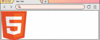
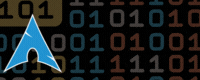

<br><br><br>

<div id="skills">
  
  <br>
  <div align="center">
    &nbsp;
    &nbsp;
    &nbsp;
    
    <br>
    &nbsp;
    &nbsp;
    &nbsp;
    <br>
    &nbsp;
    
  </div>
</div>

<br><br><br>

<div id="contact">
  
  <br>
  <div align="center">
    &emsp;&emsp;
    &emsp;&emsp;
    &emsp;&emsp;
  </div>
</div>  

<br><br><br>

<div id="stats">
  
  <br>
  <div>
    
    
  </div>
  
</div>  

<br><br><br>

<div id="msg">
  
  <br>
</div>


```js
try {
    if (u_scrolled_till_here) {
        star_repo();   //contribute to my github stats
        return "thanks in advance";
    }
} catch {
    if (u_like_the_GIFs) {
        clone_repo(use_the_GIFs);
    }
} finally {
    return "thanks for coming here \n do check my other projects";
}
```


